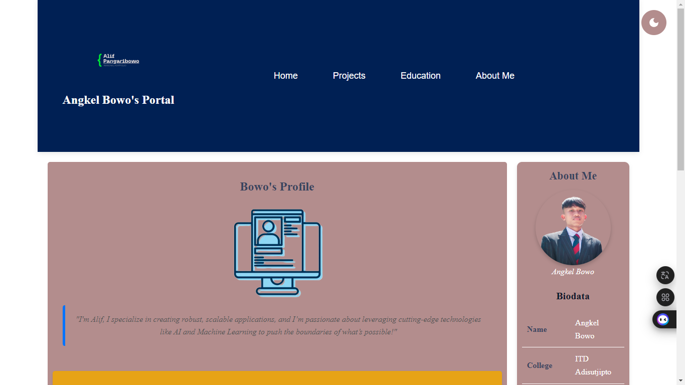
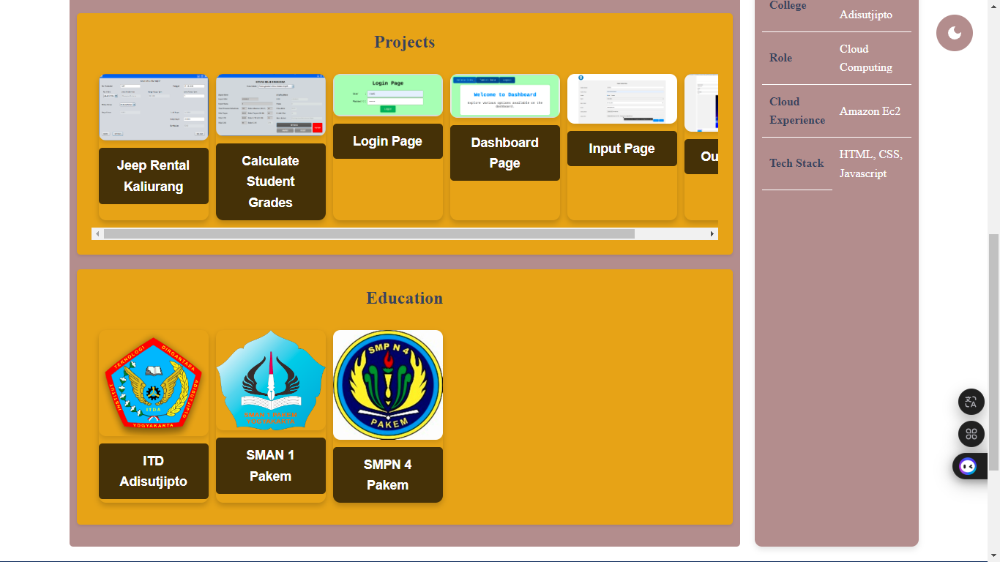
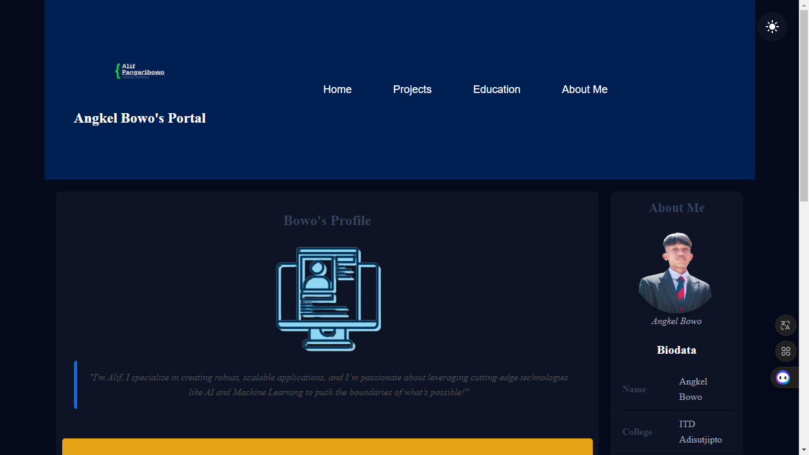
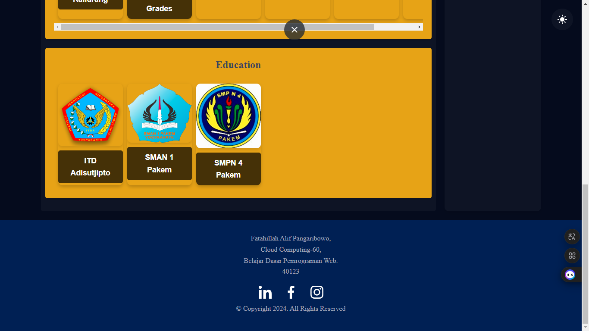

# Bowos Profile






## Description
This project is a personal profile page that includes various sections such as Home, Projects, Education, and About Me. It utilizes images and fonts sourced from W3C, and it features a dark mode implemented through JavaScript.

## Project Structure
```
bowos-profile/
├── assets/
│   ├── font/
│   └── img/
├── styles/
│   └── style.css
├── darkmode.js
├── index.html
└── README.md
```

## Getting Started

1. **Clone the Repository**
   ```bash
   git clone https://github.com/pangaribowo/bowos-profile.git
   ```
   
2. **Open the Project**
   - Navigate to the project directory:
     ```bash
     cd bowos-profile
     ```
   - Open `index.html` in your web browser.

3. **Internet Connection**
   - Ensure you are connected to the internet to load assets from W3C.

## Features
- Responsive design for different screen sizes.
- Dark mode functionality using JavaScript.
- Various sections providing an overview of projects and education.

## Author
- [Pangaribowo](https://github.com/pangaribowo)
```

---

Feel free to modify any parts of the text to better fit your style or add any additional information. If you need further assistance, let me know!